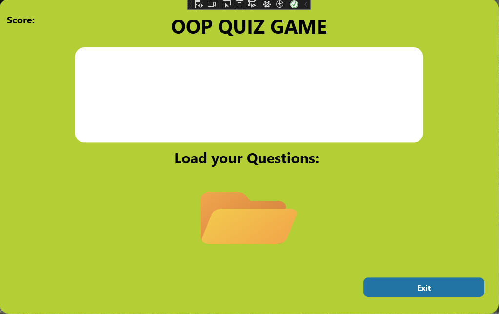
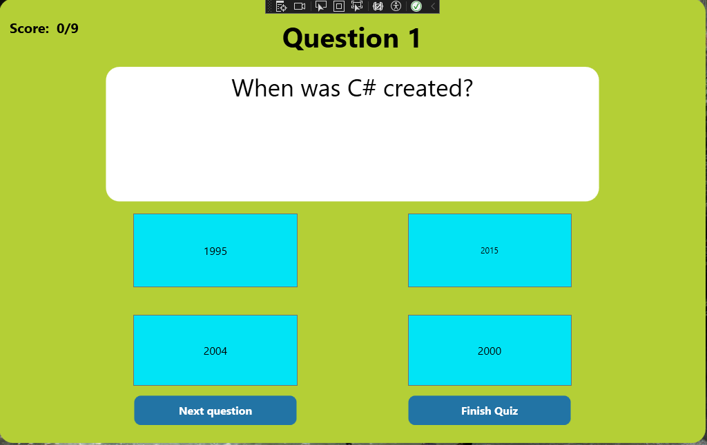
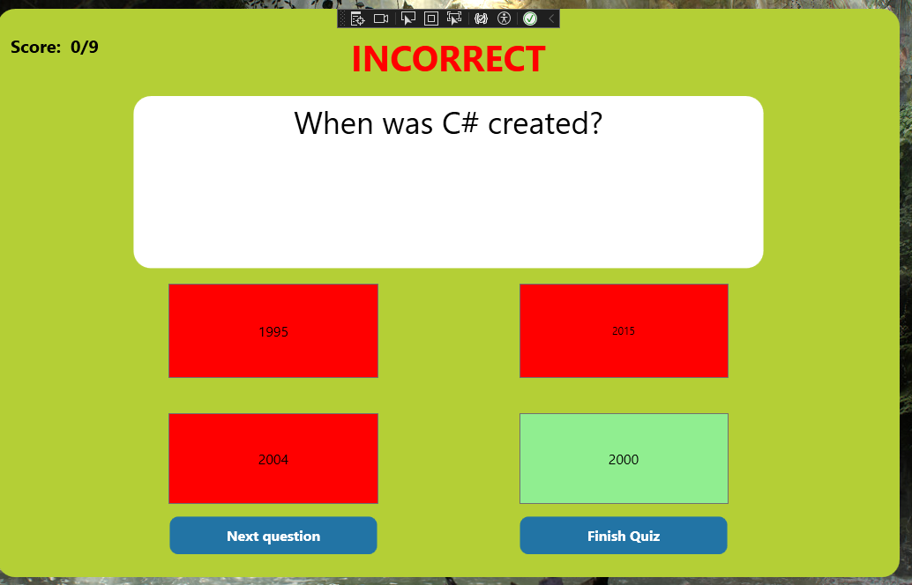

<h1 class="titles">Projects</h1>

the following projects are from various school assignments or personal projects undertaken throughout

my current education. all projects can be downloaded and ran providing required software/hardware is present.

 
<h1 class="titles">Quiz app</h1>
<h3 class="titles"> Github Repository can be accessed here: <a href="https://github.com/williamCattrell/Quiz-app">Quiz App repository</a></h3>

this desktop application is a quiz app designed and written in C# using WPF.

this project was written for an application development course alongside my teamate Griffin.

  
  
  

 
<h1 class="titles">Kotlin Compose android application</h1>
<h2 class="titles">Pokemon progress tracking app</h2>
<h3 class="titles"> Github Repository can be accessed here: <a href="https://github.com/williamCattrell/PokemonApp">PokemonApp repository</a></h3>

this application is and android app written in Kotlin using Compose and Jetpack as extensions to the language.

this project is a curent work in progress nearing completion developped and written for our application development course

for the fall 2023 semester. this is a group project that I did alongside my teammates Griffin and Lauren to complete this app

 
<h1 class="titles">DutchTreat ASP.NET web application</h1>
<h3 class="titles"> Github Repository can be accessed here: <a href="https://github.com/williamCattrell/DutchTreat">DutchTreat repository</a></h3>

this project was a web application using ASP.NET in C# to created an interactive "shopping website" that represents a full stack flow.

this application will create a local database on runtime if not present and serve the information to the user using IIS server.

this application was taught to me in order to understand how an application interacts with the web and a database to provide a service for the user

